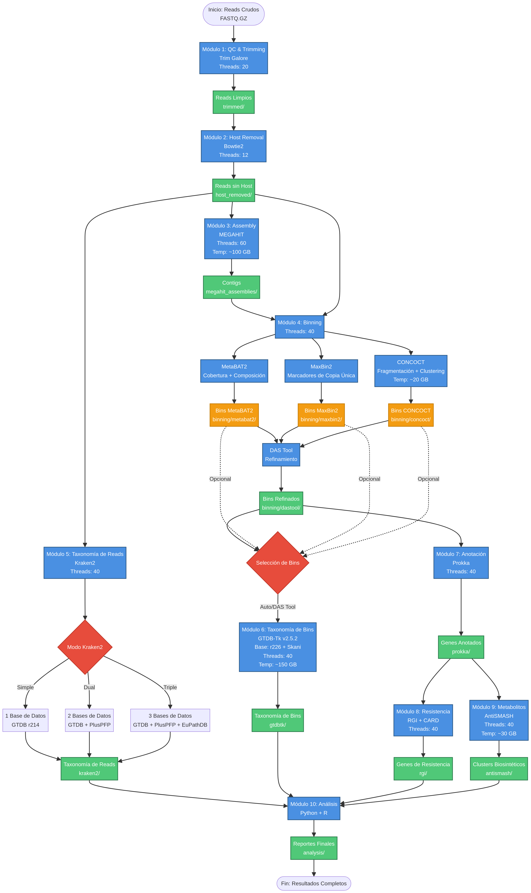

# Flujo del Pipeline Metagenómico

## 📊 Diagrama de Flujo



---

## 🔄 Descripción del Flujo

El pipeline metagenómico procesa datos de secuenciación metagenómica (reads crudos) a través de 10 módulos organizados en 4 fases principales.

---

## 📋 Fases del Pipeline

### **Fase 1: Preprocesamiento de Reads** (Módulos 1-2)

Preparación y limpieza de los datos de secuenciación antes del análisis.

#### Módulo 1: Control de Calidad y Trimming
- **Herramienta:** Trim Galore (FastQC + Cutadapt)
- **Entrada:** Reads crudos (FASTQ.GZ)
- **Proceso:** 
  - Evaluación de calidad con FastQC
  - Eliminación de adaptadores
  - Trimming por calidad (Q30)
  - Filtrado por longitud mínima
- **Salida:** Reads limpios (`trimmed/`)
- **Recursos:** 20 threads
- **Tiempo:** 30-60 min por muestra

#### Módulo 2: Remoción de ADN del Hospedero
- **Herramienta:** Bowtie2
- **Entrada:** Reads limpios
- **Proceso:**
  - Mapeo contra genoma del hospedero
  - Extracción de reads no mapeados (metagenoma)
  - Eliminación de contaminación del hospedero
- **Salida:** Reads sin hospedero (`host_removed/`)
- **Recursos:** 12 threads
- **Tiempo:** 1-2 horas por muestra

---

### **Fase 2: Ensamblaje y Binning** (Módulos 3-4)

Reconstrucción de genomas a partir de reads metagenómicos.

#### Módulo 3: Ensamblaje de Novo
- **Herramienta:** MEGAHIT
- **Entrada:** Reads sin hospedero
- **Proceso:**
  - Ensamblaje con múltiples k-mers (21-141)
  - Preset: meta-sensitive
  - Longitud mínima de contigs: 500 bp
- **Salida:** Contigs (`megahit_assemblies/`)
- **Recursos:** 60 threads, ~100 GB temp
- **Tiempo:** 4-8 horas por muestra

#### Módulo 4: Binning Metagenómico
- **Herramientas:** MetaBAT2, MaxBin2, CONCOCT, DAS Tool
- **Entrada:** Contigs + Reads sin hospedero
- **Proceso:**
  1. **MetaBAT2:** Binning basado en cobertura y composición tetranucleotídica
  2. **MaxBin2:** Binning con marcadores de genes de copia única
  3. **CONCOCT:** Binning con fragmentación de contigs y clustering
  4. **DAS Tool:** Refinamiento y selección de mejores bins
- **Salida:** 
  - `binning/metabat2/` - Bins de MetaBAT2
  - `binning/maxbin2/` - Bins de MaxBin2
  - `binning/concoct/` - Bins de CONCOCT
  - `binning/dastool/` - **Bins refinados (recomendado)**
- **Recursos:** 40 threads, ~20 GB temp (CONCOCT)
- **Tiempo:** 2-3 horas por muestra

---

### **Fase 3: Clasificación Taxonómica** (Módulos 5-6)

Identificación taxonómica a nivel de reads y genomas reconstruidos.

#### Módulo 5: Taxonomía de Reads
- **Herramienta:** Kraken2
- **Entrada:** Reads sin hospedero
- **Proceso:**
  - Clasificación taxonómica rápida con k-mers
  - Tres modos disponibles:
    - **Simple:** 1 base de datos (GTDB r214)
    - **Dual:** 2 bases de datos (GTDB + PlusPFP)
    - **Triple:** 3 bases de datos (GTDB + PlusPFP + EuPathDB)
  - Conversión a formato BIOM
- **Salida:** Tablas taxonómicas (`kraken2/`)
- **Recursos:** 40 threads
- **Tiempo:** 30-60 min por muestra por base de datos

#### Módulo 6: Taxonomía de Bins (Genomas)
- **Herramienta:** GTDB-Tk v2.5.2
- **Entrada:** Bins (DAS Tool, MetaBAT2, MaxBin2 o CONCOCT)
- **Proceso:**
  - Identificación de genes marcadores (120 bacterias, 53 arqueas)
  - Alineamiento múltiple
  - Clasificación filogenética con pplacer
  - ANI rápido con Skani
- **Salida:** Clasificación taxonómica de bins (`gtdbtk/`)
- **Base de datos:** GTDB r226
- **Recursos:** 40 threads, ~150 GB temp
- **Tiempo:** 2-4 horas (total)

---

### **Fase 4: Anotación Funcional** (Módulos 7-9)

Caracterización funcional de los genomas reconstruidos.

#### Módulo 7: Anotación de Genes
- **Herramienta:** Prokka
- **Entrada:** Bins seleccionados
- **Proceso:**
  - Predicción de genes con Prodigal
  - Anotación funcional de proteínas
  - Identificación de ARNr y ARNt
  - Generación de archivos GFF, GBK, FAA, FNA
- **Salida:** Genes anotados (`prokka/`)
- **Recursos:** 40 threads
- **Tiempo:** 1-2 horas (total)

#### Módulo 8: Genes de Resistencia a Antibióticos
- **Herramienta:** RGI (Resistance Gene Identifier)
- **Entrada:** Proteínas anotadas (Prokka)
- **Proceso:**
  - Búsqueda contra base de datos CARD
  - Identificación de genes de resistencia
  - Clasificación por mecanismo y familia
  - Predicción de fenotipo de resistencia
- **Salida:** Genes de resistencia (`rgi/`)
- **Recursos:** 40 threads
- **Tiempo:** 30-60 min (total)

#### Módulo 9: Metabolitos Secundarios
- **Herramienta:** AntiSMASH
- **Entrada:** Genomas anotados (Prokka)
- **Proceso:**
  - Identificación de clusters biosintéticos (BGCs)
  - Predicción de productos naturales
  - Comparación con bases de datos conocidas
  - Análisis de dominios y módulos
- **Salida:** Clusters biosintéticos (`antismash/`)
- **Recursos:** 40 threads, ~30 GB temp
- **Tiempo:** 2-4 horas (total)

---

### **Fase 5: Análisis y Reportes** (Módulo 10)

Integración de resultados y generación de reportes finales.

#### Módulo 10: Análisis Integrativo
- **Herramientas:** Python (pandas, matplotlib, seaborn) + R (opcional)
- **Entrada:** 
  - Taxonomía de reads (Kraken2)
  - Taxonomía de bins (GTDB-Tk)
  - Genes de resistencia (RGI)
  - Metabolitos secundarios (AntiSMASH)
- **Proceso:**
  - Análisis de diversidad alpha y beta
  - Gráficos de abundancia taxonómica
  - Tablas resumen de resistencia
  - Visualización de clusters biosintéticos
  - Generación de reportes HTML/PDF
- **Salida:** Reportes finales (`analysis/`)
- **Tiempo:** 30-60 min

---

## 🔀 Puntos de Bifurcación

### Bifurcación 1: Assembly vs Taxonomía de Reads

Después del módulo 2 (Host Removal), el pipeline se bifurca:

- **Ruta A:** Reads → Assembly (Módulo 3) → Binning (Módulo 4)
- **Ruta B:** Reads → Taxonomía de Reads (Módulo 5)

Estas rutas son **independientes** y pueden ejecutarse en paralelo.

### Bifurcación 2: Selección de Bins

Después del binning (Módulo 4), puedes elegir qué conjunto de bins usar para módulos 6-9:

- **Opción 1 (Recomendada):** DAS Tool (bins refinados)
- **Opción 2:** MetaBAT2 (bins de alta cobertura)
- **Opción 3:** MaxBin2 (bins con marcadores)
- **Opción 4:** CONCOCT (bins de baja abundancia)
- **Opción 5:** Auto (busca automáticamente)

---

## ⏱️ Tiempo Total Estimado

Para **2 muestras** con los recursos especificados:

| Fase | Módulos | Tiempo |
|------|---------|--------|
| **Preprocesamiento** | 1-2 | 2-4 horas |
| **Ensamblaje y Binning** | 3-4 | 12-18 horas |
| **Taxonomía** | 5-6 | 4-6 horas |
| **Anotación Funcional** | 7-9 | 4-8 horas |
| **Análisis** | 10 | 1 hora |
| **Total** | 1-10 | **23-37 horas** |

---

## 💾 Uso de Espacio en Disco

### Por Muestra (~5 GB de reads crudos):

| Módulo | Salida | Espacio |
|--------|--------|---------|
| 1. Trimming | Reads limpios | ~4 GB |
| 2. Host Removal | Reads sin host | ~3 GB |
| 3. Assembly | Contigs | ~500 MB |
| 4. Binning | Bins (4 métodos) | ~2 GB |
| 5. Kraken2 | Taxonomía | ~50 MB |
| 6. GTDB-Tk | Taxonomía bins | ~100 MB |
| 7. Prokka | Anotación | ~200 MB |
| 8. RGI | Resistencia | ~50 MB |
| 9. AntiSMASH | Metabolitos | ~500 MB |
| 10. Análisis | Reportes | ~100 MB |
| **Total** | | **~11 GB** |

### Archivos Temporales:

| Módulo | Espacio Temporal |
|--------|------------------|
| 3. MEGAHIT | ~100 GB |
| 4. CONCOCT | ~20 GB |
| 6. GTDB-Tk | ~150 GB |
| 9. AntiSMASH | ~30 GB |
| **Total** | **~300 GB** |

**Nota:** Los archivos temporales se eliminan automáticamente o pueden limpiarse manualmente.

---

## 🎯 Dependencias Entre Módulos

```
Módulo 1 → Módulo 2 → Módulo 3 → Módulo 4 → Módulo 6
                   ↓                      ↓
                   → Módulo 5             → Módulo 7 → Módulo 8
                                                    ↓
                                                    → Módulo 9
                                          
Módulos 5, 6, 8, 9 → Módulo 10
```

### Módulos Independientes:
- **Módulo 5** (Kraken2) puede ejecutarse en paralelo con módulos 3-4

### Módulos Dependientes:
- **Módulo 3** requiere módulo 2
- **Módulo 4** requiere módulos 2 y 3
- **Módulo 6** requiere módulo 4
- **Módulo 7** requiere módulo 4
- **Módulo 8** requiere módulo 7
- **Módulo 9** requiere módulo 7
- **Módulo 10** requiere módulos 5, 6, 8, 9

---

## 🔧 Configuración Flexible

### Ejecución Modular

Puedes ejecutar módulos individuales o grupos de módulos:

```bash
# Solo preprocesamiento (1-2)
bash metagenomics_pipeline.sh
# Seleccionar: 1, 2

# Solo binning y taxonomía (3-6)
bash metagenomics_pipeline.sh
# Seleccionar: 3, 4, 5, 6

# Solo anotación funcional (7-9)
bash metagenomics_pipeline.sh
# Seleccionar: 7, 8, 9

# Pipeline completo (1-10)
bash metagenomics_pipeline.sh
# Seleccionar: A (todos)
```

### Selección de Bins

Antes de ejecutar módulos 6-9, puedes configurar qué bins usar:

```bash
# En el menú del pipeline
# Presionar: B (Configurar fuente de bins)
# Seleccionar: 2 (DAS Tool - recomendado)
```

O mediante variable de entorno:

```bash
export BINS_SOURCE=dastool
bash metagenomics_pipeline.sh
```

---

## 📚 Archivos de Salida Principales

```
output/
├── trimmed/                    # Módulo 1
│   └── SRR5936076_R1_val_1.fq.gz
├── host_removed/               # Módulo 2
│   └── SRR5936076_R1.fastq.gz
├── megahit_assemblies/         # Módulo 3
│   └── SRR5936076/final.contigs.fa
├── binning/                    # Módulo 4
│   ├── metabat2/
│   ├── maxbin2/
│   ├── concoct/
│   └── dastool/               # ← Usar estos
├── kraken2/                    # Módulo 5
│   └── combined_taxonomy.biom
├── gtdbtk/                     # Módulo 6
│   └── GTDBTK_All_Bacteria.tsv
├── prokka/                     # Módulo 7
│   └── SRR5936076_bin.1/
├── rgi/                        # Módulo 8
│   └── SRR5936076_bin.1_rgi.txt
├── antismash/                  # Módulo 9
│   └── SRR5936076_bin.1/
└── analysis/                   # Módulo 10
    └── metagenomics_report.html
```

---

## 🚀 Siguiente Paso

Consulta `CONFIGURACION_RAPIDA.md` para instrucciones de instalación y ejecución del pipeline.

---

**Última actualización:** 5 de diciembre de 2025  
**Versión del pipeline:** 1.0  
**Módulos totales:** 10
